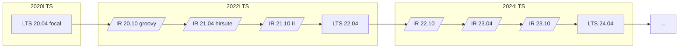

# Ubuntu 

- `Ubuntu` is a `downstream` of `Debian`
- Much of this page is a combintion of Ubuntu docs, most notably:
  - [Release Cycle docs](https://ubuntu.com/about/release-cycle)
  - [Release downloads](http://releases.ubuntu.com/)
  - [Releases wiki - a list of past, current and future releases](https://wiki.ubuntu.com/Releases) including code name, release dates, docs links, and EOL/end of support dates.

## Release Terms

- `version format` is `YY.MM` based on month of release
  - In `April (X.04)` and `October (X.10)`
- `LTS` / `Long Term Support` releases are supported for the long haul, well beyond `interim releases`
  - Every `2` years (on even numbered years) in `April` a new `LTS` is released
- `interim release` - every `6` months between `LTS` releases, an `interim release` is produced that is supported for `9` months (so half way past the next release whether that be `LTS` or `interim`)
  - stable, but with latest features (reference newer releases of packages) to test out what will go into the next `LTS` release.
- [Release cycle](https://ubuntu.com/about/release-cycle) docs
- Release cadence visualized: (remember every 6 months a new release comes out on a fixed schedule)
  - FYI [planned releases](https://wiki.ubuntu.com/ReleaseSchedule)

## Distribution channels

- `deb` package based distributions with package updates tested and released together (notably in the major 6 month updates)
- `snap` packages - better suited for 3rd party software that release independent of `Ubuntu` (more frequent updates)
  - `snap`s can be confined much like a `container` 
    - to an isolated `secure box` with constraints you place to limit what resources the app has access to (if any) 
    - OR opened up (`classic`) much like a `deb` based app where the `snap` app can see everything on the system.
- `cloud images` - `Canonical` publishes Ubuntu on all major public clouds with security updates in the latest LTS thus minimizing updates when booting new machines from these images. 
- Other `container` / `image` options that get regular security updates too
  - `Docker Hub` `images` that can be used to create a `system container`
  - `LXD images`
  - `MAAS images` - [`MAAS`](https://maas.io/docs/image-builder) is an alternative to [`packer`](https://www.packer.io/) for building images

## Editions

- `Classic` - uses a minimal set of `deb` packages to build various targets (Server, Desktop, cloud images) and only add `snaps` as needed
- `Core` - all-snap edition of Ubuntu intended for embedded systems (but nothing precludes humans from using `Core` which is much more `secure` and `highly reliable`)

## Maintenance & Security Updates

- `debs` categorized into:
  - `base system` - `main` and `restricted` debs
    - these packages are supported for `5` years in LTS releases. 
    - `universe` and `multiverse` are not considered `base`
  - `open sourced` - `main` and `universe` are open source
    - `restricted` and `multiverse` are not open source
- `ESM` - `Extended Security Maintenance` is available for `LTS` releases since `12.04`   

TODO - consider adding more of the page summarized as I see fit here.

